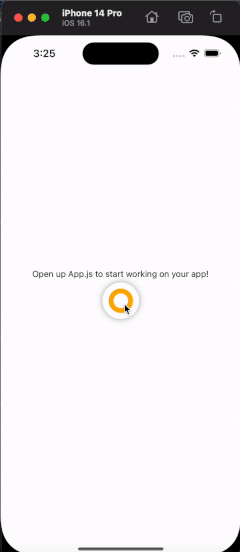

# expo-siro

The expo-siro sdk is a wrapper built around the Swift iOS SDK. It allows you to easily manage field sales recordings from an iOS device.

Please note, at this time we only support iOS. If you are interested in integrating Android, please reach out to Jake @ jake@siro.ai.



### Requirements
- iOS 15+

### Getting Started
1. Run `npx expo install expo-siro`


2. There are a couple of build settings we will need to tweek, so you'll need to install `expo-build-properties`, by running `npx expo install expo-build-properties`


3. In `app.json`, add the following to the config:
```json
{
  "expo": {
    "name": "my-app",
    "plugins": [
      [
		"expo-build-properties", 
		{
			"ios": {
				"deploymentTarget": "15.0",
				"useFrameworks": "static",
			}
		}
	  ]
    ]
  }
}
```
Alternatively, you can add those values to your `Podfile` directly:
```ruby
use_frameworks! :linkage => :static
platform :ios, 15.0
```


4. Update your plist directly or via the `app.json` file (recommened if using expo): 
```json
{
	"expo": {
		"ios": {
			"infoPlist": {
				"NSLocationWhenInUseUsageDescription": "Add your description here",
				"NSMicrophoneUsageDescription": "Add description here",
				"UIBackgroundModes": [ "audio" ]
			}
		}
	}
}
```


5. Build the iOS app by running: `npx expo run:ios`
Please note that you must run your expo app in expo development mode via `npx expo run:ios`. Running the app in expo-go (using `npx expo start` will not work as `expo-siro` uses Native Modules. If you do decide that you still would like to use expo go, you can conditioanlly import and use `expo-siro` by using `expo-constants`, see [docs here](https://docs.expo.dev/versions/latest/sdk/constants/#appownership). 

### Usage
1. call `setup` and pass in your `enviornment`. Currently we support `staging` and `production`.

2. Allow your users to login to Siro. You can use the `SiroButton`, as it fully manages the user lifecycle. On tapping the `SiroButton` a modal will be shown that prompts the user to log in. Alternatively, you can 

2. Import the `SiroButton` and drop in within any view. `SiroButton` takes no props. It controls the Siro recording modal. The Siro Recording Modal gets embedded into the root view of your app automatically. 

Please note, users must login before recording, or sending events via the `sendEvent` function. Attempting to record, or `sendEvent`s before logging in will fail. `SiroButton` fully manages the user lifecycle. Upon tapping the `SiroButton` a Login form will be displayed if the user is currently not logged in. If the user is currently logged in, the `SiroButton` will start/stop the recorder. Alternatively, you can show/hide the modal with `showModal` and `hide` functions.

```typescript
import { View } from 'react-native'
import { SiroButton, setup, showModal, hide } from 'expo-siro'

const App = () => {
	useEffect(() => {
		setup('staging')

		// Alternatively, show and hide the modal
		// show the Siro modal:
		showModal();

		// Hide Modal
		hide();
	}, [])

	return (
		<View>
			<SiroButton />
		</View>
	)
}
```


## API

### function setup(env: 'staging' | 'production')
Sets up the SiroSDK. Must be called before utilizing the SDK. If `setup` is not called, interactions with the SiroSDK will fail.
___


### function startRecording()
Starts a recording. User will be asked for access to their location + microphone upon calling the `startRecording` function if they have not yet given the SiroSDK access. Once access is granted, `startRecording` will begin recording conversations.
Please note that there can only ever be one active recording instance. User must be logged in.
___


### function stopRecording()
Stops the currently active recording session. If there is no active recording session, no action is taken.
___


### function sendEvent(eventName: string, interactionData?: InteractionData)
Sends an event along with any Lead or Interaction data. Events can trigger actions that control the Siro Recorder. 

```typescript
import { sendEvent } from 'expo-siro'

interface Coordinates {
	lat: number
    long: number
}

interface Address {
	street: string
    city: string
    state: string
    zip: string
}

interface Stage {
	id: string
    name?: string
    color?: string
    icon?: string
    won?: boolean
    interacted?: boolean
}

interface Interaction {
	// id is the unique ID of the interaction in your database.
	id: string; 

	// Optional fields	
	// leadId is the unique id of this lead in your database.
	leadId?: string;

	// userId is the ID of the currently logged in user.
	userId?: string; 
	note?: string;

	// stage is the current stage of the lead. If this interaction involved a stage change, use the stage that the lead was changed to.
	stage?: Stage; 
	coordinates?: Coordinates;
	address?: Address;
	// dateCreated is the date of the interaction. This is most likely the current date.
	dateCreated?: Date; 
	// leadDateCreated is the date that this lead was created.
	leadDateCreated?: Date; 
	contacts?: Contact[];
	// metadata is used for any additional data
	metadata?: { [key: string]: any }; 
}

const interactionData = {
	id: string // Only the ID is required
}

sendEvent('createLead', interactionData)
```
___


### function showModal() 
Show's the Siro Recording modal. The modal has two states:
- Login Form: Rendered if the user is not currently logged in.
- Recorder: Rendered if the user has authenticated successfully.
___


### function hide()
Hides/dismisses the Siro modal.
# expo-siro
